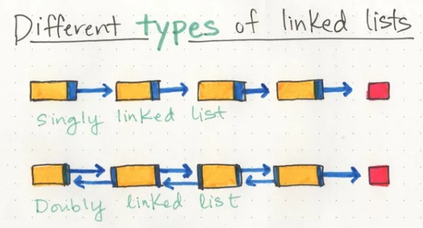

# Linked List
### What is a Linked List
* A Linked List is a sequence of Nodes that are connected/linked to each other. The most defining feature of a Linked List is that each Node references the next Node in the link.

* Why you use Linked list?
    - Helpful if you don't know the size of the list and mostly want to add and remove things quickly


* *There are two types of Linked List - Singly and Doubly.*

* > Singly - Singly refers to the number of references the node has. A Singly linked list means that there is only one reference, and the reference points to the Next node in a linked list.
* >Doubly - Doubly refers to there being two (double) references within the node. A Doubly linked list means that there is a reference to both the Next and Previous node.




* Best practice to traverse linked list is using while() loop This allows us to continually check that the Next node in the list is not null and the current variable will tell us where exactly in the linked list we are and will allow us to move/traverse forward until we hit the end

> For example 
```
ALGORITHM Includes (value)
// INPUT <-- integer value
// OUTPUT <-- boolean

  Current <-- Head

  WHILE Current is not NULL
    IF Current.Value is equal to value
      return TRUE

    Current <-- Current.Next

  return FALSE
```


### Big O 

* Travesal bigO:
    - time for Includes would be O(n). n represents the number of nodes in the linked list.

    -  space for Includes would be O(1). This is because there is no additional space being used than what is already given to us with the linked list input.

* Adding a Node at the beginning--> O(1)
* Adding a Node to the middle--> O(n)
* AddBefore --> O(n)


