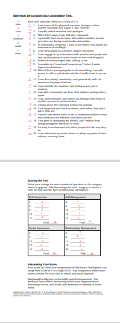

# Mindset
### why this topic matters?
A growth mindset is a way of thinking that made all successful people achieve their goals by putting in the hard work and time. without it, we keep ourselves in a fixed mindset that keeps holding selves back and blaming our problems on others.

### Someone with a fixed mindset

* Avoids challenges
* Gives up when faced with obstacles
* Ignores feedback

### Someone with a growth mindset…
* Embraces challenges
* Persists through obstacles
* Learns from feedback
* Is inspired by the success of others

### My emotional intelligence test result 
* My score is below 18 in Social Awareness and Self-Awareness so i should improve those areas by usimg feedback from others, mentoring within your organization or 
friendship circles, and books and seminars.By developing these skills, individuals can enhance their relationships, increase their emotional intelligence, and become more effective leaders.

## Things I want to know more about