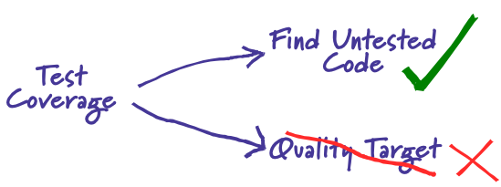

# Read Class 06

## Random Module
- The random module provides access to functions that support many operations
- we use it when we need to pick a random element from a python list.
- The Random module contain useful functions :
    - randint() -> used to create random strings within a range
    - random() -> used to generate random numbers between 0 and 1, If you want a larger number, you can multiply it by a larger value
    - choice () -> used to select a random element from a collection object 
    - randrange() ->  used to select a random element from a given range
    - shuffle() -> takes a list as an input argument and shuffles the elements in the list in place

##  Risk Analysis in Software Testing 
- Risk analysis in software testing is the process of identifying potential risks in software and prioritizing them for testing. This involves assessing the impact of risks and categorizing them based on their magnitude indicators (high, medium, low). The risk identification process includes business risks, testing risks, premature release risks, and software risks. Risk assessment involves assessing risks by effect, cause, and likelihood. To perform risk analysis, one must search for risks, analyze the impact of each individual risk, and identify measures for the risk. The use of risk analysis at the beginning of a project helps highlight potential problem areas and mitigate risks.

## TestCoverage
- Test coverage is a useful tool for finding untested parts of a codebase. Test coverage is of little use as a numeric statement of how good your tests are.

## Things I want to know more about
- nothing for now 
