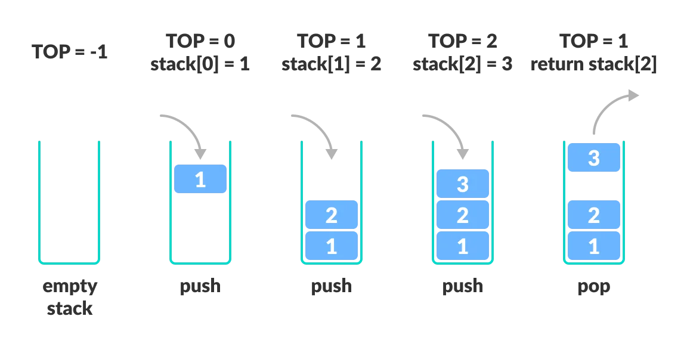

# Stacks and Queues 
### what is Stacks ?
- A stack is a data structure that consists of Nodes.Each Node references the next Node in the stack, but does not reference its previous.

### The Most common terminology:
     - Push 
     - Pop 
     - Top 
     - Peek 
     - IsEmpty 

### Stacks follow these concepts:
  - FILO (first in last out)

  - LIFO (Last In First Out)

### LIFO Principle of Stack
  

### What is Queues?
- A queue is a data structure that follows the First-In-First-Out (FIFO) principle, meaning that the first element to be added to the queue is the first one to be removed. It can be thought of as a line of people waiting to do something, where the first person in line is the first to go, and new people join the end of the line.

- two main operations: enqueue, which adds an element to the end of the queue, and dequeue, which removes the first element from the queue

- And other Common terminology for a queue is
  - Front 
  - Rear 
  - Peek 
  - IsEmpty 

### FIFO Principle for Queues

